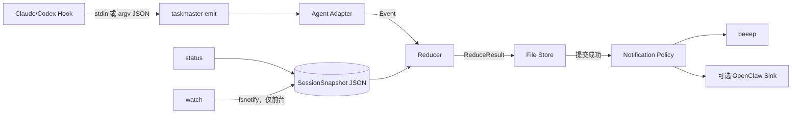
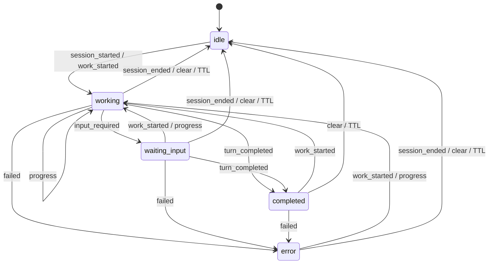

# TaskMaster Coding 参考架构方案

> 面向软件开发实习生的可执行工程蓝图。
>
> 版本：v1.0｜状态：设计已确认，可进入实现｜日期：2026-08-12

## 0. 实习生先读

TaskMaster 只解决一件事：本机并发运行 Coding Agent 时，统一显示 `working / waiting_input / completed / error`，并在需要用户关注时发通知。

四条最高原则：

1. 单 Go 二进制。
2. Agent Hook 触发，命令执行完立即退出。
3. 每会话一个 JSON；没有 daemon、端口、SQLite 或 Redis。
4. 当前 P0 环境是 **Claude Code CLI + CC Switch**；Codex 是 P1。

如果实现中出现任务分发、Agent 聊天、Web Dashboard、HTTP Server、长期历史或悬浮岛，请停止开发并重新评审范围。

---

## 1. 产品边界

### 1.1 用户痛点

开发者同时运行多个 Agent 时，不知道谁还在工作、谁等待输入、谁已经完成，因而必须一直盯着终端。

### 1.2 MVP 必须做到

- Claude Code CLI 状态变化可被捕获。
- 多会话状态互不覆盖。
- 进入 `waiting_input`、`completed`、`error` 时发送系统通知。
- `taskmaster status` 输出一次快照。
- `taskmaster watch` 在前台显示实时列表。
- 安装到测试通知中位时间不超过 5 分钟。
- CC Switch 切换 Provider 后 Hook 仍存在；若消失，`doctor` 明确报错。
- TaskMaster 任何故障都不能阻断 Agent。

### 1.3 MVP 包含

- Claude Code Adapter。
- Codex Adapter（能力探测后安装）。
- Generic Adapter，供其他 Agent 手动接入。
- 文件状态协议、TTL、短锁、原子写入。
- 原生桌面通知。
- 可选 OpenClaw 通知出口。
- `init / uninstall / emit / status / watch / doctor / clear / notify test`。

### 1.4 MVP 不包含

- Agent 编排、委派、抢占、聊天和文件锁。
- HTTP、Unix Socket、WebSocket、SSE、MCP Server。
- daemon、launchd、systemd、Windows Service。
- SQLite、Redis、历史检索、费用和 Token 分析。
- Prompt、完整响应、工具参数或代码内容采集。
- Web UI、托盘、悬浮岛和权限审批 UI。
- 云账号、遥测和默认外传。
- 全 Agent 被动日志解析；无 Hook Agent 留到 Phase 2。

---

## 2. 技术裁决与开源复用

### 2.1 已确认 ADR

| ADR | 裁决 | 原因 |
|---|---|---|
| 001 | Hook 主动上报优先 | 语义明确、低延迟，无需猜日志 |
| 002 | 每会话一个 JSON | MVP 只需当前快照，几十个文件无需数据库 |
| 003 | 无 daemon | 零空闲资源、零端口、安装简单 |
| 004 | 状态协议自有 | Agent 差异由 Adapter 吸收，核心语义不受第三方控制 |
| 005 | 状态先提交，通知后发送 | 通知失败不回滚状态、不影响 Agent |
| 006 | CC Switch 用 Common Config 集成 | 直接改其 SQLite 风险高，live 文件又可能被 Provider 切换覆盖 |

### 2.2 “乐高”清单

| 功能 | 项目 | 策略 |
|---|---|---|
| 文件监听 | [fsnotify](https://github.com/fsnotify/fsnotify) | 直接依赖，仅 `watch` 初始化；BSD-3-Clause |
| 原生通知 | [beeep](https://github.com/gen2brain/beeep) | 直接依赖；BSD-2-Clause |
| Hook 安装参考 | [code-notify](https://github.com/mylee04/code-notify) | 借鉴幂等合并与跨平台路径，不作运行时底座；MIT |
| 多 Agent Hook 参考 | [Gryph](https://github.com/safedep/gryph) | 借鉴 Adapter 覆盖；不引入其审计/SQLite；Apache-2.0 |
| JSON/TTL/锁参考 | [VibeSignal](https://github.com/yzhao062/vibesignal) | 借鉴模式，独立实现；BSD-2-Clause |
| Phase 2 UI | [Agent Island](https://github.com/tristan666666/agent-island) | 只作产品参考；MIT |
| Phase 2 推送 | [Apprise](https://github.com/caronc/apprise)、[ntfy](https://github.com/binwiederhier/ntfy) | 外部 Adapter，不嵌入核心 |

复制第三方代码时必须保留版权，并在 `THIRD_PARTY_NOTICES.md` 记录仓库、commit、文件和许可证。优先依赖或重写小逻辑，不整仓 Fork。

---

## 3. 总体架构与数据流



一次 Hook 调用必须按以下顺序完成：

1. 限长读取输入。
2. Adapter 归一化为 `Event`。
3. Store 在会话锁内读取旧快照。
4. Reducer 计算新快照、删除动作和 Transition。
5. Store 原子提交。
6. 提交成功后执行 Notification Policy。
7. 各 Sink 在总超时内 best-effort 发送。
8. 退出，不留下后台进程。

---

## 4. 代码结构和组件边界

```text
taskmaster/
├── cmd/taskmaster/main.go
├── internal/
│   ├── cli/                 # 标准库 flag；参数解析与输出
│   ├── domain/              # Event/Snapshot/Transition/枚举
│   ├── reducer/             # 纯状态机
│   ├── store/               # 路径、锁、原子文件、TTL
│   ├── notify/              # Policy、beeep、OpenClaw、熔断
│   ├── adapter/
│   │   ├── adapter.go
│   │   ├── claude/
│   │   ├── codex/
│   │   └── generic/
│   ├── installer/           # Claude/Codex/CC Switch
│   ├── doctor/
│   └── diaglog/
├── schemas/
│   ├── event.schema.json
│   └── session-snapshot.schema.json
├── testdata/{claude,codex,corrupt}/
├── docs/adapter-authoring.md
├── go.mod
├── LICENSE
└── README.md
```

| 组件 | 只负责 | 禁止负责 |
|---|---|---|
| CLI | 参数、用例调用、渲染 | 状态转换、配置合并 |
| Adapter | 原始事件转 `Event` | I/O、通知 |
| Reducer | `(old,event) → result` | 时间读取、文件、网络 |
| Store | 锁、读写、TTL | Claude/Codex 字段语义 |
| Notification Policy | 决定是否通知及脱敏文案 | 直接调用外部程序 |
| Sink | 发送已构造通知 | 决定状态 |
| Installer | detect/plan/backup/commit/verify | 修改 API Key、Provider、MCP |
| Doctor | 只读验证和修复建议 | 静默修改配置 |

核心接口：

```go
type Adapter interface {
    ID() string
    Detect(context.Context) Detection
    Normalize(context.Context, RawHookInput) (domain.Event, error)
    InstallPlan(context.Context, string) ([]ConfigPatch, error)
}

type StateStore interface {
    Load(context.Context, domain.SessionKey) (*domain.SessionSnapshot, error)
    Commit(context.Context, *domain.SessionSnapshot, domain.SessionSnapshot) error
    Delete(context.Context, domain.SessionKey) error
    List(context.Context, time.Time) ([]domain.SessionSnapshot, error)
}

type Reducer interface {
    Reduce(*domain.SessionSnapshot, domain.Event) (domain.ReduceResult, error)
}

type NotificationSink interface {
    ID() string
    Send(context.Context, domain.Notification) error
}
```

```go
type ReduceResult struct {
    Next       *SessionSnapshot // nil 表示删除；idle 不落盘
    Transition Transition
}

type Transition struct {
    From               *Status
    To                 *Status
    StateChanged       bool
    ErrorChanged       bool
    ShouldDelete       bool
    IgnoredAsDuplicate bool
}
```

错误必须支持 `errors.Is`：`ErrInvalidInput`、`ErrStaleEvent`、`ErrLockTimeout`、`ErrCorruptState`、`ErrUnsupportedEvent`。

---

## 5. 状态协议

### 5.1 枚举

```go
type Status string
const (
    StatusWorking Status = "working"
    StatusWaitingInput Status = "waiting_input"
    StatusCompleted Status = "completed"
    StatusError Status = "error"
)

type EventKind string
const (
    EventSessionStarted EventKind = "session_started"
    EventWorkStarted EventKind = "work_started"
    EventProgress EventKind = "progress"
    EventInputRequired EventKind = "input_required"
    EventTurnCompleted EventKind = "turn_completed"
    EventFailed EventKind = "failed"
    EventSessionEnded EventKind = "session_ended"
    EventCleared EventKind = "cleared"
)

type Capability string
const (
    CapabilityFull Capability = "full"
    CapabilityCompletionOnly Capability = "completion_only"
    CapabilityManual Capability = "manual"
)
```

`idle` 是“没有有效快照”的查询结果，不是持久化状态。

### 5.2 Event JSON Schema

```json
{
  "$schema": "https://json-schema.org/draft/2020-12/schema",
  "$id": "https://taskmaster.local/schemas/event-v1.json",
  "type": "object",
  "additionalProperties": false,
  "required": ["schema_version", "event_id", "agent", "session_id", "kind", "occurred_at", "source", "capability"],
  "properties": {
    "schema_version": {"const": 1},
    "event_id": {"type": "string", "minLength": 1, "maxLength": 128, "pattern": "^[A-Za-z0-9._:-]+$"},
    "agent": {"type": "string", "minLength": 1, "maxLength": 32, "pattern": "^[a-z0-9][a-z0-9_-]*$"},
    "session_id": {"type": "string", "minLength": 1, "maxLength": 256},
    "kind": {"enum": ["session_started", "work_started", "progress", "input_required", "turn_completed", "failed", "session_ended", "cleared"]},
    "occurred_at": {"type": "string", "format": "date-time"},
    "source": {"enum": ["hook", "notify", "manual", "log"]},
    "capability": {"enum": ["full", "completion_only", "manual"]},
    "project": {"type": "string", "maxLength": 128},
    "cwd": {"type": "string", "maxLength": 4096},
    "title": {"type": "string", "maxLength": 128},
    "message": {"type": "string", "maxLength": 512},
    "pid": {"type": "integer", "minimum": 1},
    "severity": {"enum": ["info", "warning", "error"]},
    "metadata": {
      "type": "object",
      "maxProperties": 16,
      "additionalProperties": {"type": "string", "maxLength": 256}
    }
  }
}
```

### 5.3 SessionSnapshot JSON Schema

```json
{
  "$schema": "https://json-schema.org/draft/2020-12/schema",
  "$id": "https://taskmaster.local/schemas/session-snapshot-v1.json",
  "type": "object",
  "additionalProperties": false,
  "required": ["schema_version", "revision", "agent", "session_id_hash", "status", "started_at", "updated_at", "expires_at", "last_event_id", "source", "capability"],
  "properties": {
    "schema_version": {"const": 1},
    "revision": {"type": "integer", "minimum": 1},
    "agent": {"type": "string", "minLength": 1, "maxLength": 32},
    "session_id_hash": {"type": "string", "pattern": "^[a-f0-9]{64}$"},
    "session_id": {"type": "string", "minLength": 1, "maxLength": 256},
    "status": {"enum": ["working", "waiting_input", "completed", "error"]},
    "project": {"type": "string", "maxLength": 128},
    "cwd": {"type": "string", "maxLength": 4096},
    "title": {"type": "string", "maxLength": 128},
    "message": {"type": "string", "maxLength": 512},
    "pid": {"type": "integer", "minimum": 1},
    "started_at": {"type": "string", "format": "date-time"},
    "updated_at": {"type": "string", "format": "date-time"},
    "expires_at": {"type": "string", "format": "date-time"},
    "last_event_id": {"type": "string", "minLength": 1, "maxLength": 128},
    "last_error_fingerprint": {"type": "string", "pattern": "^[a-f0-9]{64}$"},
    "source": {"enum": ["hook", "notify", "manual", "log"]},
    "capability": {"enum": ["full", "completion_only", "manual"]}
  }
}
```

状态文件示例：

```json
{
  "schema_version": 1,
  "revision": 7,
  "agent": "claude",
  "session_id_hash": "e3b0c44298fc1c149afbf4c8996fb92427ae41e4649b934ca495991b7852b855",
  "session_id": "0198-example-session",
  "status": "waiting_input",
  "project": "taskmaster",
  "cwd": "/Users/alice/work/taskmaster",
  "title": "Claude needs input",
  "message": "Permission required",
  "started_at": "2026-08-12T08:00:00Z",
  "updated_at": "2026-08-12T08:03:14Z",
  "expires_at": "2026-08-12T16:03:14Z",
  "last_event_id": "claude:0198:Notification:1723449794000",
  "source": "hook",
  "capability": "full"
}
```

CLI 默认只显示 session hash 前 8 位。状态目录必须仅当前用户可读写。

---

## 6. 状态机

| 状态 | 含义 | 默认 TTL | 通知 |
|---|---|---:|---|
| `working` | 正在生成或执行工具 | 15 分钟无事件 | 否 |
| `waiting_input` | 等待输入、授权或选择 | 8 小时 | 是 |
| `completed` | 当前 turn 完成 | 2 分钟 | 是 |
| `error` | Agent、认证、额度、网络或工具失败 | 8 小时 | 是 |

TTL 不靠后台计时。下一次 `emit/status/watch/clear --expired` 时忽略或清理过期文件。



Reducer 规则：

- `session_started/work_started/progress` → `working`。
- `input_required` → `waiting_input`。
- `turn_completed` → `completed`。
- `failed` → `error`，保存脱敏错误指纹。
- `session_ended/cleared` → `Next=nil`，删除文件。
- `event_id == last_event_id`：幂等成功，不重复通知。
- `occurred_at < updated_at - 2s`：`ErrStaleEvent`，不更新。
- 多会话展示优先级：`waiting_input > error > working > completed > idle`。

Notification Policy 读取 Transition：状态首次进入才通知；已处于 error 时，只有错误指纹改变且超过 60 秒冷却才再次通知。

---

## 7. Adapter 契约

```go
type RawHookInput struct {
    AgentHint string
    EventHint string
    Stdin     []byte
    ArgJSON   []byte
    Env       map[string]string
    Now       time.Time
}
```

- stdin/argv JSON 上限均为 256 KiB。
- Adapter 必须显式填写 `capability`；Reducer 不允许根据 `source` 猜测能力等级。
- 只读取白名单字段，未知字段忽略。
- 原始 Prompt、响应、工具参数不得进入状态、metadata 或日志。
- 缺 `session_id` 时丢弃，禁止把多个未知会话合并到降级键。
- `event_id` 缺失时由 Adapter 对规范字段计算 SHA-256。

### 7.1 Claude Code P0 映射

| Claude Hook | 条件 | EventKind |
|---|---|---|
| `SessionStart` | `startup/resume/clear` | `session_started` |
| `UserPromptSubmit` | 全部 | `work_started` |
| `PostToolUse` | 全部 | `progress` |
| `Notification` | `permission_prompt` | `input_required` |
| `Notification` | `idle_prompt` | `turn_completed` |
| `PermissionRequest` | 全部 | `input_required`，只观察，不审批 |
| `Stop` | 全部 | `turn_completed` |
| `StopFailure` | 全部 | `failed` |
| `SessionEnd` | 全部 | `session_ended` |

Claude command Hook 从 stdin 接收 JSON。TaskMaster 的 Hook 命令必须带 `--quiet`，stdout/stderr 均为空；绝不返回 allow/deny 或阻断结果。

概念配置如下，安装器必须把 `TASKMASTER_ABSOLUTE_PATH` 替换为真实绝对路径：

```json
{
  "hooks": {
    "UserPromptSubmit": [{
      "hooks": [{"type": "command", "command": "TASKMASTER_ABSOLUTE_PATH emit --adapter claude --event UserPromptSubmit --quiet", "timeout": 2}]
    }],
    "Notification": [{
      "matcher": "permission_prompt|idle_prompt",
      "hooks": [{"type": "command", "command": "TASKMASTER_ABSOLUTE_PATH emit --adapter claude --event Notification --quiet", "timeout": 2}]
    }],
    "Stop": [{
      "hooks": [{"type": "command", "command": "TASKMASTER_ABSOLUTE_PATH emit --adapter claude --event Stop --quiet", "timeout": 2}]
    }]
  }
}
```

实际生成器还要生成其余 P0 Hook。写 `managedHook(event, matcher, binaryPath)` 构造函数和 golden test，禁止复制九段硬编码 JSON。路径含空格、中文、反斜杠必须测试。

### 7.2 CC Switch（P0 特别要求）

CC Switch 默认数据目录为 `~/.cc-switch/`，Claude 目录默认 `~/.claude/`，但用户可在 CC Switch 中自定义 Claude 目录。

检测顺序：

1. `--cc-switch` 显式参数。
2. `~/.cc-switch/` 是否存在。
3. 只读获取版本；失败只 WARN。
4. `--claude-dir` 优先；无法确定自定义目录时要求用户明确传入。

集成规则：

- 绝不写 CC Switch SQLite。
- `init` 可更新当前 live `settings.json`，让当前 Provider 即时生效。
- 同时生成 `<state-root>/generated/cc-switch-claude-common.json`。
- 该文件只能包含 TaskMaster `hooks`，不能包含 env、API Key、Base URL、Model、MCP、permissions。
- 用户在 CC Switch 的 Claude “Edit Common Config”中合并片段并开启 Write Common Config。
- 用户切换一次 Provider 后运行 `taskmaster doctor --agent claude`。

受管 Hook 指纹：

```text
sha256(event + matcher + absolute_binary_path + "taskmaster-managed-v1")
```

Provider 切换后缺任何 P0 Hook，`doctor` 必须 FAIL，并提示重新合并 Common Config。TaskMaster 不自动操作 CC Switch UI。

### 7.3 Codex P1

版本间 Hook 能力不同，必须探测：

| 等级 | 行为 |
|---|---|
| `full` | 安装 SessionStart/UserPromptSubmit/PostToolUse/PermissionRequest/Stop |
| `completion_only` | 仅配置 `notify` 的 `agent-turn-complete` |
| `manual` | 只支持 Generic Adapter |

Codex TUI 和 `codex exec` 分别探测、分别在 doctor 展示。completion-only 不能伪造 working/waiting，只产生短 TTL completed。Codex notify JSON 作为单个 argv 参数传入，不是 stdin。

### 7.4 Generic Adapter

```bash
taskmaster emit --adapter generic --agent custom --session sess-123 \
  --kind work_started --project demo --quiet
```

必填：agent、session、kind。时间默认当前 UTC。

---

## 8. File State Store

### 8.1 路径

| 平台 | 根目录 |
|---|---|
| macOS | `~/Library/Application Support/taskmaster/` |
| Linux | `$XDG_STATE_HOME/taskmaster/`，否则 `~/.local/state/taskmaster/` |
| Windows | `%LOCALAPPDATA%\TaskMaster\` |

```text
<root>/
├── sessions/<agent>/<sha256-session-id>.json
├── locks/<agent>-<sha256-session-id>.lock/
├── backups/<timestamp>/
├── generated/cc-switch-claude-common.json
├── config.json
├── sink-health.json
└── diagnostics.log
```

Unix 目录 `0700`、文件 `0600`；Windows 使用当前用户目录默认 ACL。Agent ID 只接受安全正则，session 永远哈希为文件名。

### 8.2 原子提交

```text
mkdir 指定会话 lock-dir
→ 最多抖动等待 75ms
→ 读取和校验旧快照
→ Reduce
→ 同目录创建临时文件
→ 写 JSON + newline
→ fsync file
→ chmod 0600（Unix）
→ atomic rename/replace
→ fsync parent（平台支持时）
→ 删除本次 lock-dir
```

锁 mtime 超过 2 秒视为遗留锁。锁超时则记录并放弃事件，退出 0；禁止绕过锁写入。后续 Hook 会刷新状态。

### 8.3 损坏与日志

- 目标快照损坏：移动为 `*.corrupt.<timestamp>`，从 revision 1 重建；每会话最多留 3 份。
- `status/watch` 跳过损坏文件并显示 degraded 数量。
- `diagnostics.log` 为 JSONL，单条 ≤2 KiB；到 1 MiB 轮换一次。
- 日志只含时间、组件、错误码、agent、session hash 前 8 位和脱敏错误。
- 禁止记录原始 Hook JSON、Prompt、响应、Key 或完整 Webhook URL。

---

## 9. 通知、OpenClaw 与熔断

### 9.1 通知规则

| 状态 | 规则 |
|---|---|
| waiting_input | 首次进入通知 |
| completed | 只从 working/waiting 进入时通知 |
| error | 首次进入通知；新错误指纹且过冷却可再通知 |
| working/idle | 不通知 |

标题 ≤64 字符，正文 ≤200 字符，只含 Agent、项目 basename、状态和脱敏短消息。

总 Hook 预算 750 ms：beeep 预算 250 ms，OpenClaw 预算 400 ms；剩余预算不足时跳过外部 Sink。一个 Sink 失败仍尝试另一个，状态不回滚。

### 9.2 熔断

`<root>/sink-health.json` 只保存每 Sink 的失败次数、熔断截止、最后成功时间，并原子写入：

- 连续失败 3 次，熔断 5 分钟。
- 到期后允许一次 half-open。
- 成功即关闭并清零。
- 没有后台计时器；下次事件时比较时间。
- `notify test` 可进行 half-open 测试。

### 9.3 OpenClaw 可选 Sink

```json
{
  "sinks": {
    "desktop": {"enabled": true},
    "openclaw": {
      "enabled": false,
      "binary": "/absolute/path/to/openclaw",
      "channel": "telegram",
      "target": "USER_CONFIGURED_TARGET",
      "account": "default",
      "timeout_ms": 400
    }
  }
}
```

调用等价于：

```bash
/absolute/path/to/openclaw message send --channel telegram \
  --account default --target 'USER_CONFIGURED_TARGET' \
  --message 'Claude needs input · taskmaster'
```

实现必须使用 `exec.CommandContext(binary, args...)`，禁止 shell 拼接。binary/channel/target 只能来自本地配置，不能来自 Hook payload。默认关闭，不建重试队列，不向 OpenClaw Agent 注入任务。

---

## 10. CLI 与安装体验

```text
taskmaster init [--dry-run] [--agent claude|codex] [--profile full|minimal]
                [--claude-dir PATH] [--cc-switch]
taskmaster uninstall [--agent ...] [--restore-backup]
taskmaster emit --adapter ID [adapter flags] [--quiet] [--strict]
taskmaster status [--json] [--all]
taskmaster watch [--json]
taskmaster doctor [--json] [--agent ...]
taskmaster clear [--session ID] [--expired] [--all]
taskmaster notify test [--sink desktop|openclaw]
taskmaster version
```

### 10.1 五分钟安装：Claude CLI + CC Switch

```bash
# 1. 从 GitHub Release 下载当前平台二进制，校验 SHA-256，放入 PATH
taskmaster version

# 2. 先预览
taskmaster init --dry-run --agent claude --cc-switch

# 3. 安装 live Hook 并生成 Common Config 片段
taskmaster init --agent claude --cc-switch

# 4. 按提示将 generated JSON 合并到 CC Switch Claude Common Config
# 5. 切换一次 Provider 后验证
taskmaster doctor --agent claude

# 6. 观察
taskmaster watch
```

### 10.2 init 事务

1. Detect：路径、版本、能力。
2. Plan：构造 Patch，不写文件；记录源文件 SHA-256。
3. Validate：解析变更后的 JSON/TOML。
4. Backup：复制到 `<root>/backups/<timestamp>/`。
5. Commit：临时文件 + 原子替换。
6. Verify：重新读取、确认受管 Hook 指纹。
7. Smoke：注入测试事件并读取快照。
8. Notify：测试系统通知。
9. Report：列出成功项和人工步骤。

Commit 前失败不得有修改；Verify 失败用本次备份回滚。Plan 后源文件变化则重新 Plan 一次，再变则退出，禁止覆盖。

### 10.3 幂等与卸载

- 重复 init 更新 TaskMaster 自己的绝对路径和参数，不重复添加。
- 保留所有未知字段和非 TaskMaster Hook，禁止重排。
- uninstall 只删除 TaskMaster 管理项。
- `--restore-backup` 才允许整文件恢复。
- JSON/TOML 无法解析时拒绝修改并报告行列。

### 10.4 输出和退出码

| 场景 | 普通命令 | emit 默认 | emit strict |
|---|---:|---:|---:|
| 成功 | 0 | 0 | 0 |
| 输入错误 | 2 | 0 | 2 |
| 配置/状态损坏 | 3 | 0 | 3 |
| 外部依赖不可用 | 4 | 0 | 4 |
| 内部错误 | 10 | 0 | 10 |

安装进 Hook 的 emit 必须带 `--quiet`，无论成功或非严格失败都不写 stdout/stderr。

### 10.5 watch

- 前台运行，Ctrl-C 退出。
- 启动先全量读取。
- 监听 sessions 父目录，不监听单文件，兼容原子替换。
- debounce 50 ms 后全量重扫，不维护第二份真相。
- fsnotify 失败时警告并降级为 2 秒轮询。

### 10.6 doctor 检查项

1. 二进制版本和绝对路径。
2. 状态目录权限和原子写能力。
3. Claude CLI 路径和版本。
4. Claude 配置目录与 settings.json 解析。
5. 全部 P0 Hook 及绝对路径。
6. CC Switch、自定义 Claude 目录和切换后 Hook 指纹。
7. 系统通知能力。
8. Codex TUI/exec 能力等级（若存在）。
9. OpenClaw binary、channel 与 target（若启用，target 必须掩码）。

每项输出 `PASS/WARN/FAIL/SKIP` 和可复制修复命令。doctor 只读。

---

## 11. 错误处理矩阵

| 故障 | emit 行为 | 可见性 |
|---|---|---|
| 非法/超长 JSON | 丢弃，默认 0 | diagnostics；strict 非零 |
| 未知 Hook | 丢弃，默认 0 | debug 诊断 |
| 缺 session ID | 丢弃 | fixture/doctor |
| 状态目录不可写 | 不通知，0 | doctor FAIL |
| 快照损坏 | 隔离并重建 | doctor WARN |
| 锁超时 | 放弃事件，禁止无锁写 | counter |
| rename 失败 | 保留旧状态，不通知 | doctor FAIL |
| beeep 失败 | 保留状态，尝试后续 Sink | 熔断/WARN |
| OpenClaw 超时 | 不重试 | 熔断/WARN |
| CC Switch 覆盖 Hook | 当前状态可能缺失 | doctor FAIL + Common Config 指引 |
| 崩溃无 SessionEnd | TTL 后忽略 | 正常降级 |
| 时钟回拨 | TTL 容忍 5 分钟并记录 | WARN |

---

## 12. 测试与验收

### 12.1 单元测试

- Reducer：所有 EventKind × 所有旧状态、重复、迟到、恢复、TTL、错误去重。
- Adapter：每个 Hook 最小合法 fixture、未知字段、缺字段、错误类型、超长和控制字符。
- Store：Schema、100 goroutine/10 session、revision、故障注入、stale lock、corrupt、权限。
- Installer golden：空配置、保留 hooks/plugins/permissions/env、重复安装、精准卸载、路径空格/中文/反斜杠。
- Notification：仅目标跃迁通知、失败不回滚、熔断三次开启和 half-open。

Reducer 不访问真实时间或文件系统，`now` 必须注入。

### 12.2 集成测试

1. 临时 HOME 执行 init。
2. 用 fixture stdin 调用真实 emit 子进程。
3. `status --json` 断言状态。
4. 发 Stop/SessionEnd 断言转换和删除。
5. fake notifier 断言通知次数。
6. fake OpenClaw 断言 argv 分离、超时和无 shell 注入。

### 12.3 本机 P0：Claude CLI + CC Switch

- [ ] dry-run 不修改文件。
- [ ] init 后 Provider、Key、MCP、permissions、plugins 不变。
- [ ] 新会话出现 working。
- [ ] 权限/输入出现 waiting_input，只通知一次。
- [ ] 完成出现 completed，只通知一次。
- [ ] SessionEnd 删除或 TTL 正确过期。
- [ ] 3 个并发 Claude 会话互不覆盖。
- [ ] CC Switch 切换 Provider 往返后 Hook 仍存在。
- [ ] 切换后 doctor 的 P0 项全部 PASS。
- [ ] 通知故意失败时 Claude 不被 Hook 阻断。
- [ ] uninstall 后非 TaskMaster Hook 完整保留。

### 12.4 CI 与发布

GitHub Actions：Ubuntu/macOS/Windows；Go 当前稳定版和前一稳定版；运行 gofmt check、go vet、go test、支持平台的 race test、build。

Release：darwin arm64/amd64、linux arm64/amd64、windows amd64；提供 SHA-256 和 SBOM。

### 12.5 性能门槛

| 指标 | 门槛 |
|---|---:|
| 下载到测试通知 | 中位数 ≤5 分钟 |
| 无通知 emit | p95 <150 ms |
| 含通知 emit | p95 <750 ms |
| 空闲 CPU/内存/端口 | 0/0/0 |
| 单状态文件 | <8 KiB |
| 原始 Hook 输入 | ≤256 KiB |
| status 扫描 100 会话 | p95 <100 ms |
| Hook 故障阻断 Agent | 0 次 |

不达标时优先减少 Hook 频率或外部 Sink，不引入 daemon/数据库。

---

## 13. 实习生开发顺序

每项一个小 PR；前一步测试未通过，不进入下一步。

### PR 1：Domain + Reducer

交付领域类型、纯 Reducer、转换表测试、两份 Schema。

### PR 2：File Store

交付平台路径、哈希、锁、原子写、revision、TTL、损坏隔离和并发测试。

### PR 3：Generic Adapter + 基础 CLI

交付 generic emit、status、clear、quiet/strict。此时无需 Claude 即可演示全状态机。

### PR 4：通知

交付 Policy、beeep、fake Sink、去重、熔断、notify test。

### PR 5：Claude Adapter

交付 fixtures、Normalize、P0 映射和真实 Claude CLI smoke test。

### PR 6：Claude + CC Switch Installer

交付 detect/plan/dry-run/backup/commit/verify/uninstall、Common Config 生成和 golden tests。绝不写 CC Switch SQLite。

### PR 7：watch + doctor

交付 fsnotify 父目录监听、轮询降级、全部 doctor 检查和 JSON 输出。

### PR 8：Codex P1

交付 full/completion_only/manual 探测，TUI/exec 分开报告。

### PR 9：OpenClaw + Release

交付安全 argv、超时、熔断、脱敏和三平台产物。没有 OpenClaw 时核心路径必须完全正常。

---

## 14. Code Review 红线

- [ ] 是否引入 daemon、端口、数据库或隐藏后台任务？是则拒绝。
- [ ] Adapter 是否只有转换，Reducer 是否仍是纯函数？
- [ ] 是否可能泄漏 Prompt、响应、Token、Key 或完整错误栈？
- [ ] TaskMaster 失败是否可能阻断 Agent？
- [ ] 配置修改是否备份、原子、幂等并保留未知字段？
- [ ] 是否覆盖路径空格、Windows 反斜杠和非 ASCII？
- [ ] 外部命令是否使用参数数组而非 shell 拼接？
- [ ] 是否有失败路径测试？
- [ ] Schema、fixture 和 doctor 是否同步更新？
- [ ] 是否保持“单二进制 + 零常驻 + 协议可控”？

---

## 15. Phase 2 与完成定义

只有 MVP 连续使用 4 周、Hook 成功率 ≥99%、安装中位数 ≤5 分钟，并验证至少 3 类 Agent 的真实需求后，才讨论：

1. 被动日志 Adapter。
2. Apprise/ntfy 外部推送。
3. 托盘/灵动岛，只读同一状态协议。
4. 只有出现明确跨进程订阅和历史查询需求，才评估 localhost daemon + SQLite。

MVP Definition of Done：

- Claude Code CLI + CC Switch P0 手工验收全部通过。
- 三平台 CI 和 Release 产物可用。
- init/重复 init/uninstall 不损坏用户配置。
- 3 个并发 Claude 会话正确且通知不重复。
- TaskMaster 任意故障不阻断 Claude。
- 无 daemon、无端口、无 SQLite、无遥测。
- Schema、fixtures、doctor、安装文档齐全。
- 未参与设计的实习生仅凭本文能安装、测试并解释组件边界。

满足以上条件才标记 `v0.1.0`。

---

## 16. 官方资料与兼容风险

- [Claude Code Hooks 官方参考](https://code.claude.com/docs/en/hooks)
- [CC Switch 配置目录](https://github.com/farion1231/cc-switch/blob/main/docs/user-manual/en/1-getting-started/1.5-settings.md)
- [CC Switch Common Config 架构](https://github.com/farion1231/cc-switch/blob/main/docs/release-notes/v3.12.0-en.md)
- [CC Switch Hook 丢失历史问题](https://github.com/farion1231/cc-switch/issues/1656)
- [Codex 配置 Schema](https://github.com/openai/codex/blob/main/codex-rs/core/config.schema.json)
- [Codex exec Hook 覆盖差异](https://github.com/openai/codex/issues/18607)
- [Codex notify 降级方式](https://github.com/openai/codex/issues/3962)

Agent 行为会随版本变化。Adapter fixture、运行时能力探测和 `doctor` 是事实来源；不得把某个版本的行为当作永久契约。
